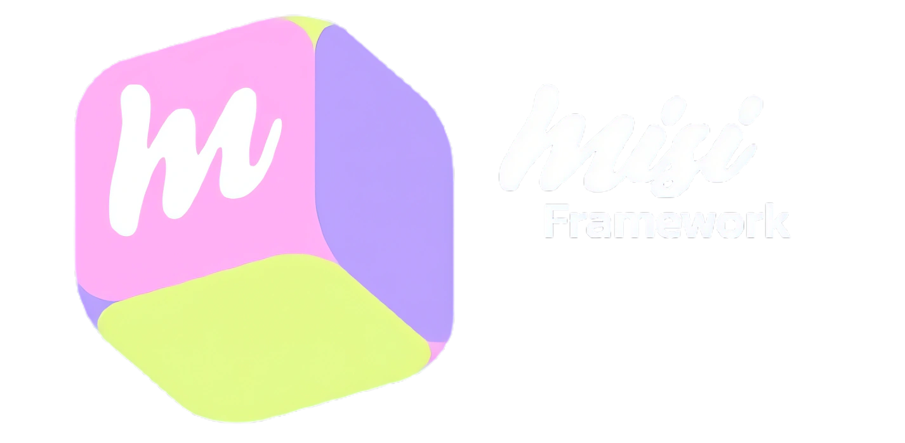

<div align="center">

<picture>
  <source media="(prefers-color-scheme: dark)" srcset="docs/readme_assets/misi-framework.svg">
  <source media="(prefers-color-scheme: light)" srcset="docs/readme_assets/misi-framework-dark.svg">
  
</picture>


<p align="center">
  <strong>our own PHP development framework for quickly building administrative systems for small businesses; no over-engineering, no fluff.</strong>
</p>

<p align="center">
  <a href="https://misi.freedev.app">Website</a> ·
  <a href="#">Docs</a> ·
  <a href="#">CLI</a> ·
</p>

<p align="center">
  <em>Proprietary project for internal use. Not publicly distributed.</em>
</p>

---


</div>

<p align="justify">
MISI IS NOT a general-purpose framework and DOES NOT compete with Laravel, Symfony, or similar professional tools. It is an internal, reusable tool, built by and for an independent developer who creates small and medium-sized commercial systems, with a single goal: to stop reinventing the same technical infrastructure for every project.

> **Philosophy:** Build repetitive technical features once and reuse them across multiple projects; then build a layer of reusable business features on top of that.

Misi’s success isn’t measured by how many features it has, but by a single question:

> **How much time do I save when creating the second project?**
</p>

| | |
|---|---|
| **Technical framework** | Configuration, routing, HTTP, database, authentication, validation, sessions, security, storage, logging. It doesn't know what an “order” or a “customer” is. |
| **Business Core** | Reusable administrative features across projects (`Misi\Business\`): customers, products, categories — without industry-specific logic. |
|  **Modules** | Features specific to a particular business type (`Modules\`), leveraging the Business Core. Currently: `Catalog`. |
|  **CLI (`misi`)** | Development commands with grouped syntax, aliases, and guaranteed backward compatibility. |
|  **Security** | Prepared statements, CSRF, HTTP headers, and noisy failures instead of silent bypasses. |

---

## Using Misi

<table>
<tr>
<td width="50%" valign="top" align="justify">

<h3>Starting a new project</h3>

Build the foundation for a new administrative system by reusing the entire Framework and Business Core that have already been built.

**[→ Go to Getting Started](#getting-started)**

</td>
<td width="50%" valign="top" align="justify">

<h3>Extend the framework</h3>

Add a new business module (`Modules\`) or generalize a Business Core feature when 2 or more real projects use it repeatedly.

**[→ Go to Business Core and Modules](#business-core)**

</td>
</tr>
<tr>
<td colspan="2" valign="top" align="justify">

<h3>Deploy the project on shared hosting</h3>

FTP + MySQL/MariaDB + PHP 8+. No Docker, no SSH, no persistent processes. Verified support for InfinityFree.

**[→ Go to Requirements and Deployment](#requirements-and-deployment)**

</td>
</tr>
</table>

---

## Getting Started

```bash
misi new <nombre>             # create a new project based on the framework
misi doctor                   # diagnose the current project's environment
misi db migrate                # run pending migrations (core + modules)
misi serve                     # start the development server (alias: run)
misi make module <Nombre>      # scaffold a new business module
misi create business <tipo>    # create/activate a business type (currently: catalog)
```
<p align="justify">
  Run <code>misi help</code> (or just <code>misi</code>) for the full command reference — server, database, generators (<code>make:*</code>), and Business Core commands, each with grouped-syntax aliases (e.g. <code>db migrate</code> / <code>migrate</code>) kept for backward compatibility.
</p>

---

## Business Core

<p align="justify">

Namespace `Misi\Business\`. Reusable administrative features across projects, without industry-specific logic:

- `CustomerRepository`
- `ProductRepository` — includes `adjustStock()`, atomic inventory adjustment via a single `UPDATE ... WHERE stock_quantity + ? >= 0`, without application-level locking.
- Category support

**Orders** and other entities (Payments, Deliveries, Files, Reports, Users as a business entity) are deliberately **frozen**: they will be generalized only when two or more real projects exhibit the same data structure.
</p>

---

### Modules

Namespace `Modules\`. A module can contain:

```
Module/
├── Controllers/
├── Services/
├── Repositories/
├── Models/
├── Views/
├── routes.php
├── migrations/
└── module.php
```

**Implemented:**
<p align="justify">

`Catalog` — the first actual module that uses the Business Core, with RBAC-protected routes and an admin panel.

**On Hold:** `Inventory`, `Clothing`, `Embroidery` — these will be implemented when there are actual projects that justify them.
</p>

---

## Requirements and Deployment
<p align="justify">

Misi is designed for traditional PHP hosting, **without** requiring:

Docker / Kubernetes · Composer on the server (optional, with its own *fallback*) · SSH access · Redis · Node.js in production · persistent processes, workers, or WebSockets.

**Target deployment:** FTP + MySQL/MariaDB + PHP 8+.

Verified deployment support is available for **InfinityFree**, including security headers, `ext-mbstring` verification during bootstrap, and adjustments for environments without a remote connection to MySQL.

---

## Why Misi Exists
<p align="justify">

Misi is part of a software development business model:

1. Identify common problems faced by small businesses.
2. Create systems to solve them.
3. Reuse the same foundation.
4. Tailor each system to the client.
5. Reduce development time and costs.
6. Charge for implementation → customizations → maintenance.
7. Evolve reusable components.
8. Eventually turn solutions into SaaS products.

</p>

---

## Layered Architecture

```
                    Misi
                      │
        ┌─────────────┴─────────────┐
        │                           │
    FRAMEWORK                 BUSINESS CORE
   (namespace Misi\)         (namespace Misi\Business\)
        │                           │
        │                     Clientes, Productos,
        │                     Categorías, (Pedidos,
        │                     Pagos, etc. — futuros)
        │                           │
        └─────────────┬─────────────┘
                       │
                    MODULES
                 (namespace Modules\)
                       │
              ┌────────┼────────┐
              ↓        ↓        ↓
           Catalog  (futuros: Ropa, Bordados, Inventario)
                       │
                       ↓
                  CUSTOMER APPLICATION
```

| Level | Responsibility |
|---|---|
| **1. Framework** | Generic technical tools: does not know what an “order” or a “customer” is. |
| **2. Business Core** | Administrative functionalities that can be reused across projects, without industry-specific logic. |
| **3. Modules** | Functionality specific to a particular type of business (e.g., `Catalog`), utilizing the Business Core. |
| **4. Application** | The final project delivered to a client: configuration, module selection, visual customization, and custom rules. |

---

## Tools Used

     

---

## Roadmap and Frozen Features
<p align="justify">

Explicitly frozen, documented with their rationale in `ROADMAP.md`, and revisited only when a real need is observed in two or more projects:

- Route groups and named routes
- Query Builder / ORM
- Generalization of Orders in the Business Core
- Users entity in the Business Core
- Payments, Deliveries, Files, Reports in the Business Core
- `Modules\Inventory`, `Modules\Clothing`, `Modules\Embroidery`

This is not “work pending to be done soon”: it is work deliberately postponed to avoid over-engineering.
</p>

---

## Project Work Principles
<p align="justify">

- **Phased approach:** Each phase requires full implementation, real end-to-end testing against MariaDB, updated documentation, and explicit approval before moving forward.
- **Audit before modifying:** All new work begins by reviewing the existing code and documentation to confirm that the current architecture is intentional.
- **Cross-verification:** Regression tests after every change, functional HTTP tests via `curl` against a live server, and PHP linting.
- **No abstraction without a real need:** No functionality is added speculatively.
- **Additive migrations only:** Schema changes are made using new files, never by editing existing ones.
- **Verify before documenting:** All examples were tested end-to-end against a live instance before being published.
</p>

---

## Directory Structure

```
Misi/
├── .misi/                    # Technical core (namespace Misi\) — hidden on purpose
│   ├── Core/
│   ├── Database/
│   ├── Http/
│   ├── Routing/
│   ├── Auth/
│   ├── Security/
│   ├── Validation/
│   ├── Storage/
│   ├── Logging/
│   ├── Exceptions/
│   └── Support/
│
├── business/                 # Business Core (namespace Misi\Business\)
│   └── ...                   # CustomerRepository, ProductRepository, etc.
│
├── modules/                  # Business modules (namespace Modules\)
│   └── Catalog/
│
├── app/                      # This repo's own demo controllers (namespace App\)
│
├── bin/
│   ├── biz                   # Framework CLI (runs inside a project)
│   ├── misi                  # Global CLI wrapper (Linux/macOS)
│   └── build-landing.php     # Builds index.html + public/views/*.html from
│                              # public/views/_partials/ and _content/
├── misi.cmd                  # Windows CLI wrapper (batch)
├── misi.ps1                  # Windows CLI wrapper (PowerShell)
│
├── bootstrap/
├── config/
├── routes/
│
├── public/
│   ├── css/
│   ├── js/
│   └── views/                # Generated marketing pages (/cli, /misi, /ui-kit, ...)
│                              # plus their _partials/ and _content/ sources
├── resources/
│   ├── views/                # PHP views rendered through the router (welcome, ui-kit)
│   ├── scaffold/              # Template copied by "misi new" into every new project
│   └── stubs/                 # Templates used by the make:* generators
│
├── storage/
│   ├── logs/
│   ├── cache/
│   └── uploads/
│
├── database/
│   ├── migrations/
│   └── seeders/
│
├── docs/
│
├── index.html                 # This repo's own marketing landing page (generated,
│                               # see bin/build-landing.php — not part of "misi new")
├── install.sh                  # Global installer (sh + PowerShell polyglot script)
├── .env.example
├── .gitignore
└── README.md
```

Note this tree describes **this repository** (the framework's own source, including its demo `Catalog` module and marketing site). A project created with `misi new` gets a much smaller, separate structure — `.misi/`, `bootstrap/`, `config/`, `bin/`, `routes/` (the technical plumbing) plus `backend/{modules,database}`, `templates/`, `public/{css,js}`, `.env` and `index.html` (the actual application) — with none of `business/`, `app/`, `resources/`, `docs/`, or this landing page copied in.

---


## Author

**Emily Monterrosa Castro - Full Stack Developer** <br>
[GitHub](https://github.com/emilymontec) · [LinkedIn](https://www.linkedin.com/in/emilymontec/) · [Portfolio](https://emilymontec.github.io/portfolio/)

---

## License

Proprietary project for internal use. Not publicly distributed.

---

<!--
## Appendices
See the [UserGuide](docs/MANUAL%20USUARIO%20KEISY%20MEDICAL.pdf) to learn more.

If you want to know more about the system, please check the [Documentation](docs/DOCUMENTACION%20TECNICA%20KEISY%20MEDICAL.pdf).
-->
